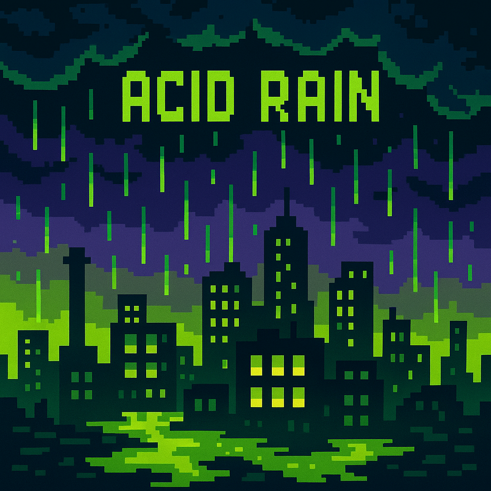

# AcidRain v1.1b



> **Advanced Acid Rain System** - Advanced acid rain system for Minecraft servers

## 📋 Description

AcidRain is a unique Minecraft plugin that adds a dynamic acid rain system with automatically expanding dangerous zone boundaries. Players must use special protective suits to survive in dangerous zones.

## ✨ Features

- 🌧️ **Dynamic acid rains** with visual effects
- 🗺️ **Automatically expanding boundaries** of dangerous zones
- 🛡️ **Protective suits** with limited duration
- 🎨 **Visual effects** - particles, sounds, fog
- 🌍 **4 danger levels** zones with different effects
- 🔧 **Full configuration** via config.yml
- 🌐 **Multilingual** (English/Russian) with in-game language switching
- ⚡ **Folia compatibility** 1.21.6

## 🚀 Installation

1. **Download** JAR file from releases
2. **Place** in `plugins/` folder
3. **Restart** server
4. **Configure** `config.yml` to your needs

## 📖 Commands

| Command | Description | Permission |
|---------|-------------|------------|
| `/acidrain` | Main plugin command | `acidrain.admin` |
| `/aon` | Enable acid rain | `acidrain.admin` |
| `/aoff` | Disable acid rain | `acidrain.admin` |
| `/aset <blocks>` | Set safe zone border | `acidrain.admin` |
| `/aexpand <blocks> <minutes>` | Expand dangerous zone border | `acidrain.admin` |
| `/astatus` | Show system status | `acidrain.admin` |
| `/asuit` | Get protective suit | `acidrain.admin` |
| `/arecipes` | Show crafting recipes | `acidrain.admin` |
| `/atime` | Check suit time | `acidrain.suit` |
| `/adiscord` | Discord server | `acidrain.admin` |
| `/alang <ru\|en>` | Change language | `acidrain.admin` |

## ⚙️ Configuration

### Basic settings
```yaml
language: "en"         # Plugin language (en/ru)
dangerZoneStart: 1100  # Safe zone size
acidRainEnabled: true  # Are acid rains enabled
```

### Danger zones
- **Zone 1** (1100-1400 blocks) - Weak danger
- **Zone 2** (1400-1850 blocks) - Medium danger  
- **Zone 3** (1850-2600 blocks) - Strong danger
- **Zone 4** (2600+ blocks) - Deadly danger

### Protective suit
- **Duration**: 60 minutes
- **Timer with pause** when armor is removed
- **Removes all effects** of radiation when equipped

### Localization
- **Languages**: Russian (ru) and English (en)
- **In-game switching**: Use `/alang <ru|en>` command
- **Configuration**: Set `language: "ru"` or `language: "en"` in config.yml

## 🎮 Gameplay

1. **Safe zone** - players are safe
2. **Dangerous zones** - require protective suit
3. **Auto-expansion** - boundaries grow automatically
4. **Protection** - suit protects from all effects

## 🔧 Technical requirements

- **Minecraft**: 1.21+
- **Server**: Folia 1.21.6+ (recommended)
- **Java**: 17+
- **Memory**: 2GB+ RAM

## 📞 Support

- **Discord**: [https://discord.gg/gV2KmUbqXC](https://discord.gg/gV2KmUbqXC)
- **Version**: 1.1b
- **Authors**: Flaim and SubTeams

---

# AcidRain v1.1b

> **Advanced Acid Rain System** - Продвинутая система кислотных дождей для Minecraft серверов

## 📋 Описание

AcidRain - это уникальный плагин для Minecraft, который добавляет динамическую систему кислотных дождей с автоматически расширяющимися границами опасных зон. Игроки должны использовать специальные защитные костюмы для выживания в опасных зонах.

## ✨ Особенности

- 🌧️ **Динамические кислотные дожди** с визуальными эффектами
- 🗺️ **Автоматически расширяющиеся границы** опасных зон
- 🛡️ **Защитные костюмы** с ограниченным временем действия
- 🎨 **Визуальные эффекты** - частицы, звуки, туман
- 🌍 **4 уровня опасности** зон с разными эффектами
- 🔧 **Полная настройка** через config.yml
- 🌐 **Мультиязычность** (Русский/Английский) с переключением языка в игре
- ⚡ **Совместимость с Folia** 1.21.6

## 🚀 Установка

1. **Скачайте** JAR файл из релизов
2. **Поместите** в папку `plugins/`
3. **Перезапустите** сервер
4. **Настройте** `config.yml` под свои нужды

## 📖 Команды

| Команда | Описание | Права |
|---------|----------|-------|
| `/acidrain` | Основная команда плагина | `acidrain.admin` |
| `/aon` | Включить кислотные дожди | `acidrain.admin` |
| `/aoff` | Выключить кислотные дожди | `acidrain.admin` |
| `/aset <блоки>` | Установить границу безопасной зоны | `acidrain.admin` |
| `/aexpand <блоки> <минуты>` | Расширить границу опасной зоны | `acidrain.admin` |
| `/astatus` | Показать статус системы | `acidrain.admin` |
| `/asuit` | Получить защитный костюм | `acidrain.admin` |
| `/arecipes` | Показать рецепты крафта | `acidrain.admin` |
| `/atime` | Проверить время костюма | `acidrain.suit` |
| `/adiscord` | Discord сервер | `acidrain.admin` |
| `/alang <ru\|en>` | Изменить язык | `acidrain.admin` |

## ⚙️ Конфигурация

### Основные настройки
```yaml
language: "ru"         # Язык плагина (ru/en)
dangerZoneStart: 1100  # Размер безопасной зоны
acidRainEnabled: true  # Включены ли кислотные дожди
```

### Зоны опасности
- **Зона 1** (1100-1400 блоков) - Слабая опасность
- **Зона 2** (1400-1850 блоков) - Средняя опасность  
- **Зона 3** (1850-2600 блоков) - Сильная опасность
- **Зона 4** (2600+ блоков) - Смертельная опасность

### Защитный костюм
- **Длительность**: 60 минут
- **Таймер с паузой** при снятии брони
- **Удаляет все эффекты** радиации при надевании

### Локализация
- **Языки**: Русский (ru) и Английский (en)
- **Переключение в игре**: Используйте команду `/alang <ru|en>`
- **Конфигурация**: Установите `language: "ru"` или `language: "en"` в config.yml

## 🎮 Игровой процесс

1. **Безопасная зона** - игроки в безопасности
2. **Опасные зоны** - требуют защитный костюм
3. **Авторасширение** - границы растут автоматически
4. **Защита** - костюм защищает от всех эффектов

## 🔧 Технические требования

- **Minecraft**: 1.21+
- **Сервер**: Folia 1.21.6+ (рекомендуется)
- **Java**: 17+
- **Память**: 2GB+ RAM

## 📞 Поддержка

- **Discord**: [https://discord.gg/gV2KmUbqXC](https://discord.gg/gV2KmUbqXC)
- **Версия**: 1.1b
- **Авторы**: Flaim and SubTeams

## 📝 Лицензия

Этот плагин был создан для развлечения и был построен за 24 часа с использованием ChatGpt и DeepSeek.

---

**⭐ Не забудьте поставить звездочку, если плагин вам понравился!**
